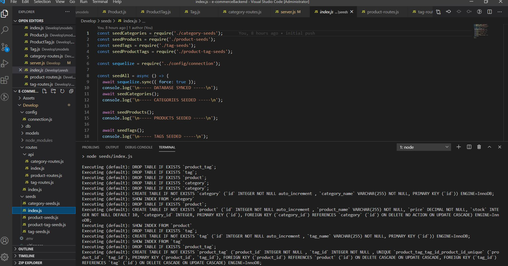
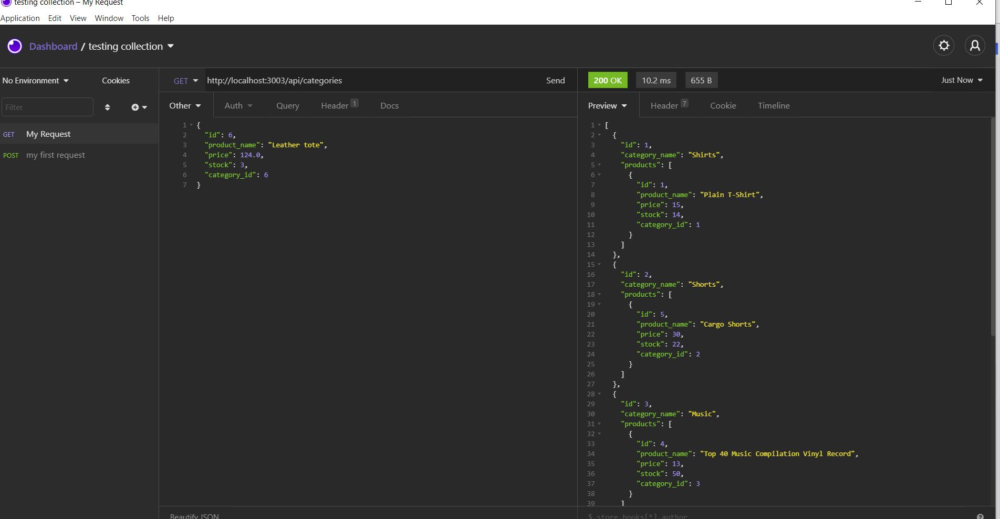
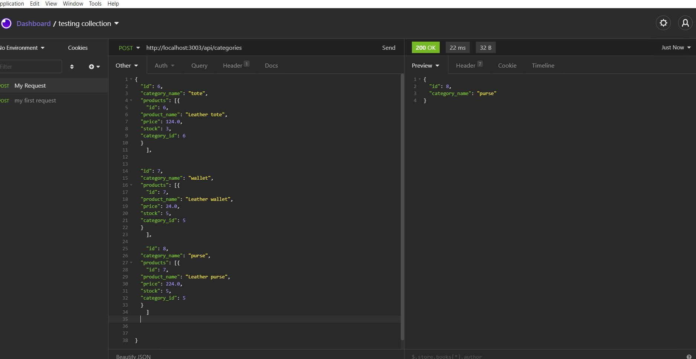
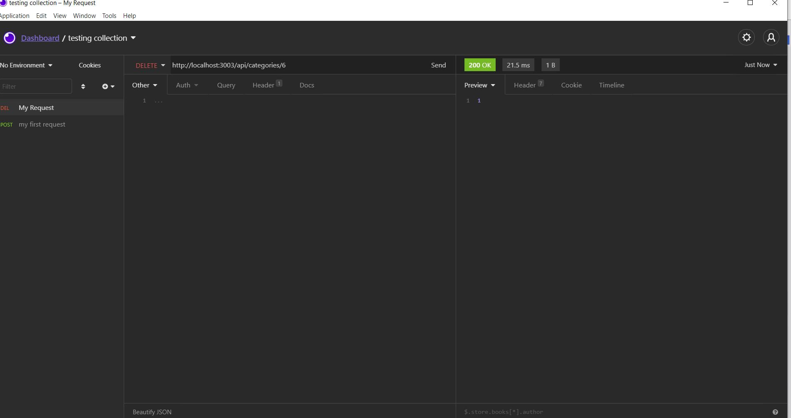

# e-commerceBackend

## Description 
This is a homework for University of Oregon bootcamp. 
My tasks is to the back end of an e-commerce site by modifyung the starter code. Configure a working Express.js API to use Sequelize to interact with a MySQL database.

## Mock-Up

## Getting Started
I use...
* MySQL Database
* Insomia

### NPM packages use
* express
* mydql2
* sequelize
* nodemon

## Walkthrough Video

